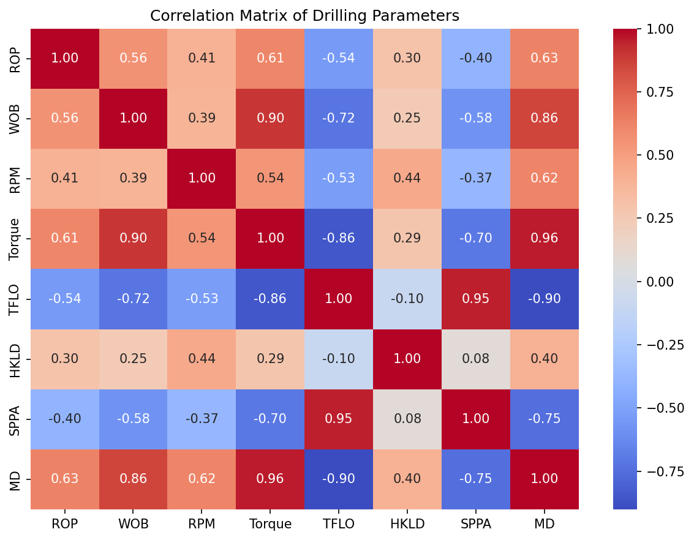
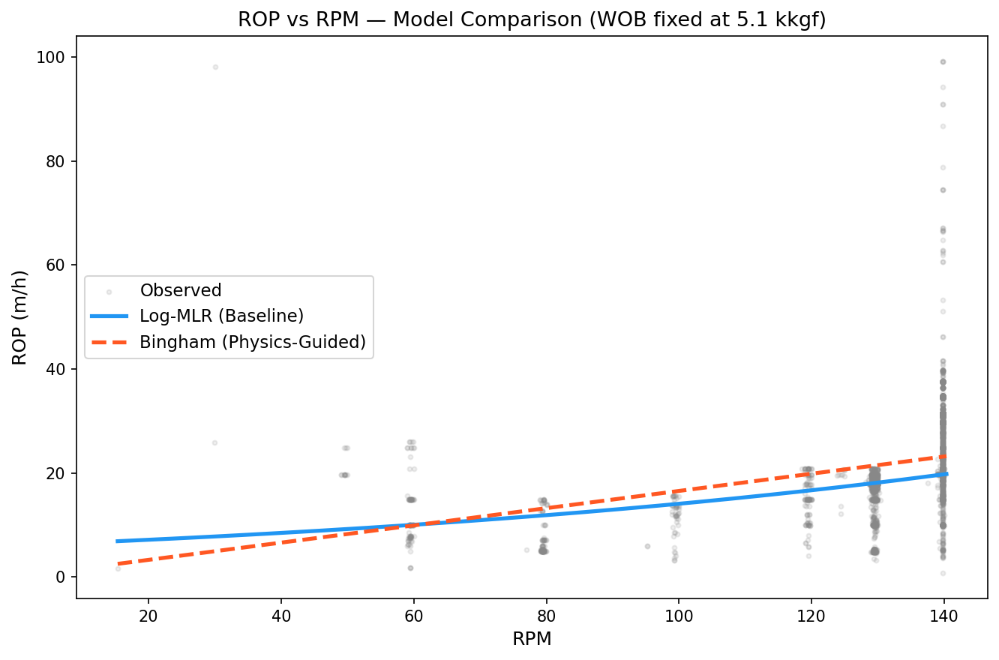

# Physics-Guided ROP Prediction

**Combining classical drilling physics with statistical modeling to predict Rate of Penetration (ROP) from ~53,000 real-time well observations.**

---

## Overview

This project applies a **physics-guided machine learning** approach to predict drilling Rate of Penetration (ROP) the speed at which the drill bit penetrates rock. Instead of relying solely on statistical regression, we integrate the **Bingham ROP equation**, a well-established petroleum engineering model, and compare it against a log-transformed linear baseline.

The key insight: by using **Variance Inflation Factor (VIF)** analysis to systematically remove collinear variables (SPPA, TFLO, Torque, HKLD, MD), we reduce 7 candidate features down to just 2 **Weight on Bit (WOB)** and **RPM**, which are the exact inputs to the classical Bingham model. Statistics and domain physics converge.

---

## Results

| Model | Type | RMSE (m/h) |
|-------|------|------------|
| Log-MLR | Statistical Baseline | 7.8946 |
| **Bingham** | **Physics-Guided (MLE)** | **7.8215** |

The physics-guided Bingham model achieves a **lower RMSE** while using a physically interpretable functional form:

$$\text{ROP} = K \cdot \left(\frac{\text{WOB}}{D_b}\right)^a \cdot \text{RPM}$$

where `K = 0.4287` (drillability constant) and `a = 0.2127` (WOB exponent) are estimated via nonlinear least-squares.

---

## Key Visualizations

### Correlation Matrix — Feature Selection


### Model Comparison — ROP vs RPM


---

## Dataset

~53,000 real-time drilling observations from the **USROP_A 3 N-SH-F-15d** well.

| Column | Unit | Description |
|--------|------|-------------|
| `WOB` | kkgf | Weight on Bit |
| `RPM` | rpm | Rotations Per Minute |
| `ROP` | m/h | Rate of Penetration (target) |
| `SPPA` | kPa | Standpipe Pressure |
| `Torque` | kN·m | Torque |
| `TFLO` | L/min | Total Flow Rate |
| `HKLD` | kkgf | Hookload |
| `MD` | m | Measured Depth |
| `TVD` | m | True Vertical Depth |

See [`data/README.md`](data/README.md) for full column documentation.

---

## Methodology

1. **Exploratory Data Analysis**: scatter plots, histograms, correlation heatmaps
2. **VIF-Based Variable Selection**: iteratively removing features with VIF > 5 to eliminate multicollinearity
3. **Log-MLR Baseline**: `log(ROP) ~ WOB + RPM` via OLS (R² = 0.384)
4. **Bingham Physics Model**: nonlinear curve fitting via `scipy.optimize.curve_fit`
5. **Residual Diagnostics**: Q-Q plots, Breusch–Pagan heteroscedasticity test

---

## Quick Start

```bash
# 1. Clone the repository
git clone https://github.com/mushahid-raza5/Physics_Guided_ROP_Prediction.git
cd Physics_Guided_ROP_Prediction

# 2. Install dependencies
pip install -r requirements.txt

# 3. Run the full pipeline
python src/main.py
```

Output plots are saved to `assets/`.

---

## Repository Structure

```
Physics_Guided_ROP_Prediction/
├── assets/                        # Generated plots for README
│   ├── correlation_matrix.png
│   └── model_comparison.png
├── data/
│   ├── README.md                  # Dataset documentation
│   └── USROP_A 3 N-SH-F-15d - Final.csv
├── notebooks/
│   ├── 01_EDA.ipynb               # Exploratory Data Analysis
│   ├── 02_Models.ipynb            # Feature Selection & Model Fitting
│   ├── 03_Results.ipynb           # RMSE Comparison & Visualizations
│   └── Physics_Guided_Rop_Prediction_Master_File.ipynb   # Original complete notebook
├── reports/
│   ├── Mushahid_Raza_Final_Project.pdf
│   └── Mushahid_Raza_Final_Project.pptx
├── src/
│   ├── __init__.py
│   ├── main.py                    # Runnable entry point
│   └── model.py                   # Core modeling functions
├── .gitignore
├── LICENSE
├── README.md
└── requirements.txt
```

---

## License

This project is licensed under the [MIT License](LICENSE).
